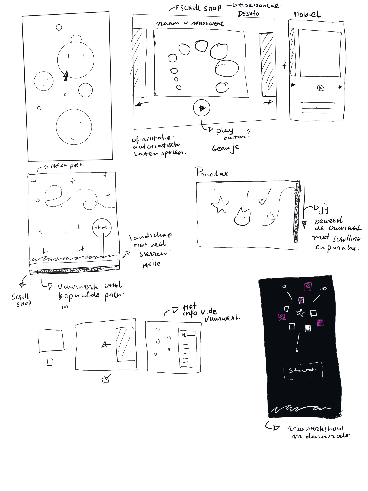

# Eindopdracht - Interactieve vuurwerkshow

## Week 1 - Planning
De opdracht die ik ga kiezen is de Interactieve vuurwerkshow.

De CSS technieken die ik ga gebruiken zijn:
- Prefer-color-scheme
- Prefer reduced motion
- Gradients 
- Motion path 
- 3D Transforms en animatie

### Code uitdagingen:
- Ik moet proberen om uit mijn comfortzone te gaan. Ik heb de neiging om dingen niet te probren die ik niet kan begrijpen of kan. Moet deze keer wel gaan doen.
- Ik heb moeite om specifiek berekening te gebruiken in css, bijvoorbeeld met calc(). Ook heb ik moeite met de waardes van bijvoorbeeld box-shadows etc.

## Eerste schetsen

### Toelichting
Hier heb ik een aantal ideeen voor mijn opdracht geschets.
Ik heb technieken van css toegevoegd die ik kan implementeren in mijn project.

CSS technieken zoals:
- Scroll-snap
- prefer color scheme
- Paralax
- 3D Transform
- Motion path met svg
- Interactie met :has selector
- Gradients

### Planning
- Inspiratie zoeken van andere werken
- Inspiratie beelden verzamelen
- Schetsen maken van mogelijke ideeen
- Ideen kiezen en breakdownschets maken
- Eerste stukje proberen te coderen

# Voortgang 1
Stapje van de versie 
Idee  vakjes met verschillende vuurwerken, dus met animatie en de vakken swipen met scroll-snap. 

