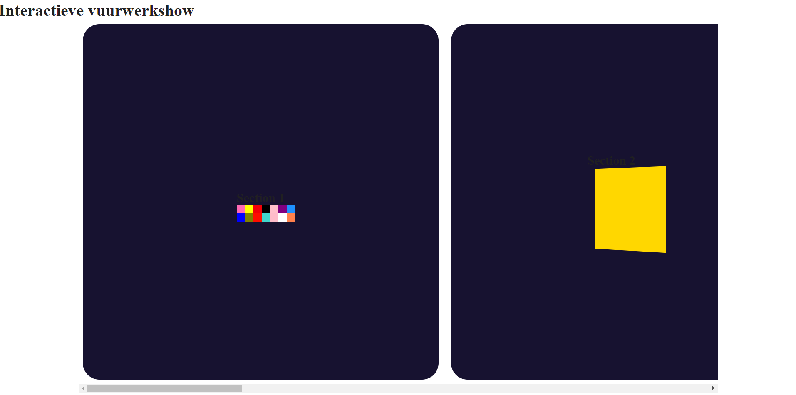
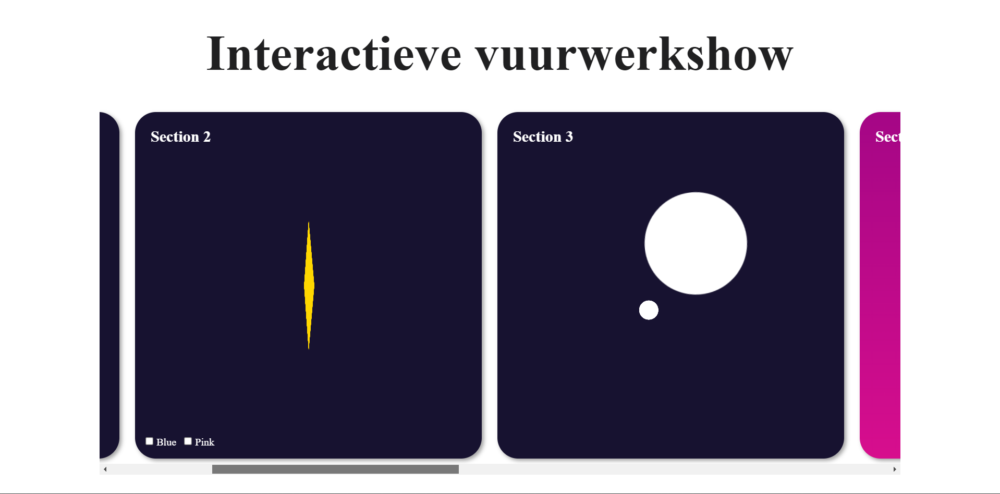

# Eindopdracht - Interactieve vuurwerkshow

## Week 1 - Planning
De opdracht die ik ga kiezen is de Interactieve vuurwerkshow.

De CSS technieken die ik ga gebruiken zijn:
- Prefer-color-scheme
- Prefer reduced motion
- Gradients 
- Motion path 
- 3D Transforms en animatie

### Code uitdagingen:
- Ik moet proberen om uit mijn comfortzone te gaan. Ik heb de neiging om dingen niet te probren die ik niet kan begrijpen of kan. Moet deze keer wel gaan doen.
- Ik heb moeite om specifiek berekening te gebruiken in css, bijvoorbeeld met calc(). Ook heb ik moeite met de waardes van bijvoorbeeld box-shadows etc.

## Eerste schetsen

### Toelichting
Hier heb ik een aantal ideeen voor mijn opdracht geschets.
Ik heb technieken van css toegevoegd die ik kan implementeren in mijn project.

CSS technieken zoals:
- Scroll-snap
- prefer color scheme
- Paralax
- 3D Transform
- Motion path met svg
- Interactie met :has selector
- Gradients

### Planning
- Inspiratie zoeken van andere werken
- Inspiratie beelden verzamelen
- Schetsen maken van mogelijke ideeen
- Ideen kiezen en breakdownschets maken
- Eerste stukje proberen te coderen

# Voortgang 1
Stapje van de versie 
Idee  vakjes met verschillende vuurwerken, dus met animatie en de vakken swipen met scroll-snap. En andere css technieken proberen

---
# Week 2
Na de eerste voortganggesprek heb ik meer onderzoek gedaan aan verschillende css technieken die ik kan gebruiken voor mij vuurwerk showcase. Alleen ik moest nog leren hoe ze werken. Dus ik probeer bij elke vakje, een css techniek toepassen en elke keer opbouwen als ik nieuwe dingen leert. 

Wat ik heb geleerd waren:
- 3D CSS Animatie
- De werking van CSS gradients.
- Geanimeerde pixels
- Werken met :has() selectors

### Eerste CSS Animatie 
Om animatie in css te maken, gebruiken we `@keyframes`. Zoals bij animaties programmas bepaal je aantal keyframes en je zeg het wat moet 
gebeuren. 

Hier ben ik begonnen met ik begonnen met de eerste tween animaties voor mijn interactieve vuurwerkshows. Het zijn animatie die ik heb geleerd tijdens de thema sessie van Sanne. 

Bij de eerste section heb ik een soort van pixel animatie maken met behulp van box-shadows. Daarna probeer ik de box-shadow te animeren met @keyframes. 

Bij de tweede section heb ik de vierkant op een 3D ruimte gedraaid. Ik heb de property `transform-style: preserve-3d` gebruikt bij. Dus wanneer ik de `transform` property gebruikt het gebeurd het allemaal in een driedimensionale ruimte. Dus bij de tweede section heb je een flip effect met de rotate bij de X-Axis.

### 3D transform

Verder heb ik een beetje gespeeld met 3D Animatie. Ik heb verschillende properties geprobeerd, zoals  `perspective`, `transform-style: preserver-3d` en `transform-origin`. 

Ik wil het een beetje interactief maken dat en ik heb de has selector gebruikt.

# Voortgang 2
